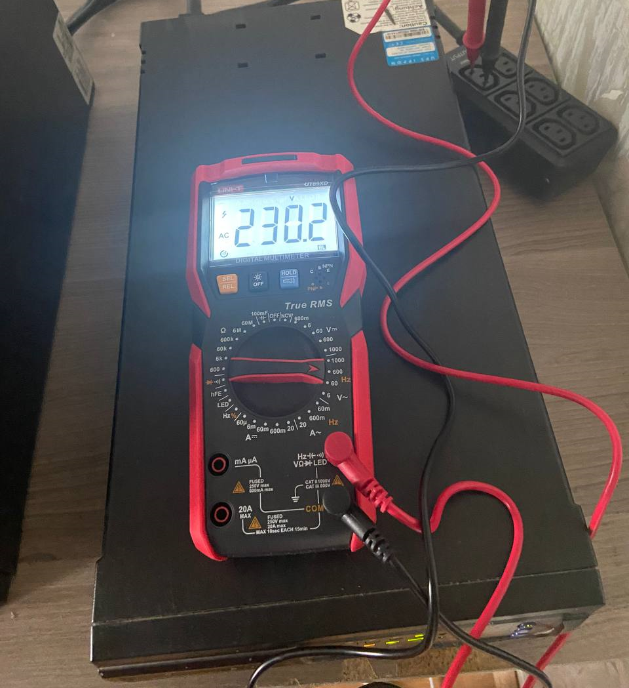
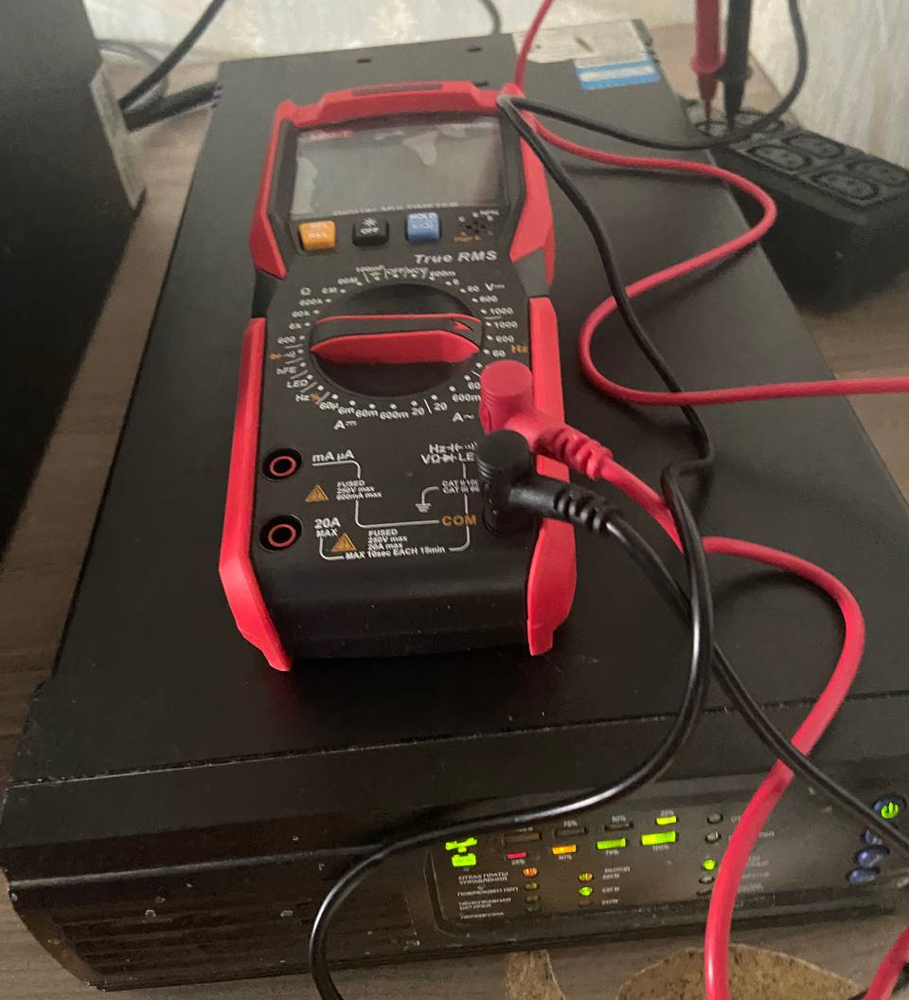
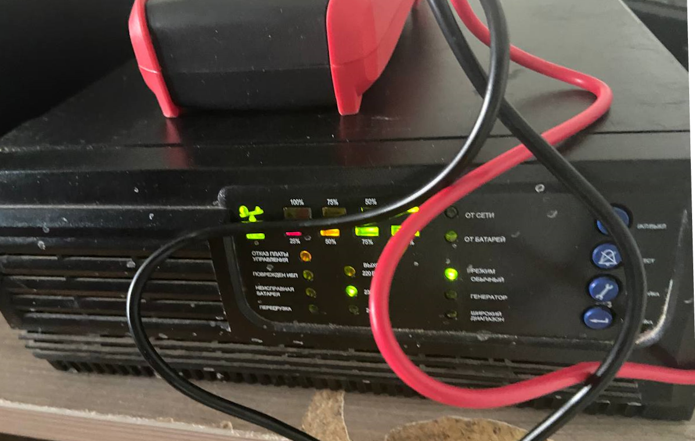

# Journal

## 22.07.2023

Project description started

## 29.07.2023

* Проведён тест по запуску блока питания без батарей. Запуск пройден успешно. Состояние: Ошибка по батареи.

* К отключённому от сети UPS подключили блок с батареями. Запуск пройден успешно. Тест батареи пройден успешно. Состояние: Ошибки отсутствуют.

Проведены замеры напряжения и тест перехода с питания от сети на питание от батарей.

    
Фото замеров

